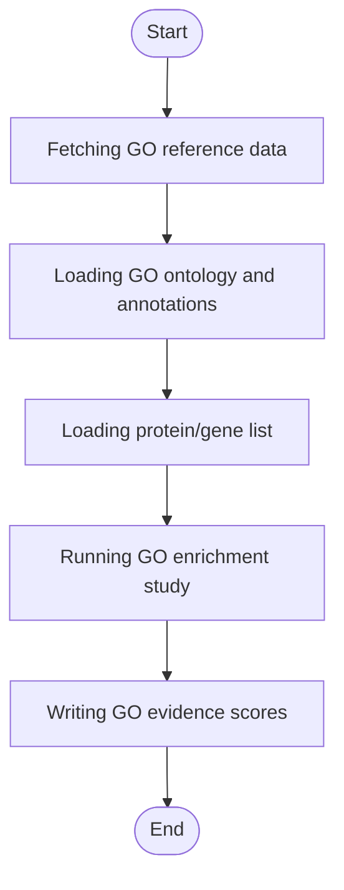

# Lyso-IP GO Evidence


## Installation

**[⬇️ Click here to install in Cauldron](http://localhost:50060/install?repo=https%3A%2F%2Fgithub.com%2Fnoatgnu%2Flysoip-go-evidence-plugin)** _(requires Cauldron to be running)_

> **Repository**: `https://github.com/noatgnu/lysoip-go-evidence-plugin`

**Manual installation:**

1. Open Cauldron
2. Go to **Plugins** → **Install from Repository**
3. Paste: `https://github.com/noatgnu/lysoip-go-evidence-plugin`
4. Click **Install**

**ID**: `lysoip-go-evidence`  
**Version**: 1.0.0  
**Category**: lysoip-qc  
**Author**: CauldronGO Team

## Description

goatools enrichment test for the expected subcellular-compartment GO term(s), default lysosomal. Downloads ~47MB of GO reference data on first run and caches it locally (~200MB uncompressed).


## Workflow Diagram



## Runtime

- **Environments**: `python`

- **Entrypoint**: `lysoip_go_evidence.py`

## Inputs

| Name | Label | Type | Required | Default | Visibility |
|------|-------|------|----------|---------|------------|
| `gene_lookup_file` | Protein / Gene List | file | Yes | - | Always visible |
| `expected_go_terms` | Expected GO Terms | text | No | GO:0005764,GO:0005765,GO:0043202,GO:0007041 | Always visible |

### Input Details

#### Protein / Gene List (`gene_lookup_file`)

Any tidy file with protein and gene columns, e.g. abundance_long.tsv or differential_expression.tsv from earlier lysoip-* plugins


#### Expected GO Terms (`expected_go_terms`)

Comma-separated GO term IDs for the expected compartment. Default: lysosome, lysosomal membrane, lysosomal lumen, lysosomal transport.


## Outputs

| Name | File | Type | Format | Description |
|------|------|------|--------|-------------|
| `go_evidence` | `go_evidence.tsv` | data | tsv | Per-protein GO evidence score (-log10 of the best BH-FDR q-value among matched expected terms); proteins with no match get no row |

## Requirements

- **Python Version**: >=3.11

### Python Dependencies (External File)

Dependencies are defined in: `requirements.txt`

- `goatools>=1.4.0`

> **Note**: When you create a custom environment for this plugin, these dependencies will be automatically installed.

## Example Data

This plugin includes example data for testing:

```yaml
  gene_lookup_file: examples/gene_lookup.tsv
```

Load example data by clicking the **Load Example** button in the UI.

## Usage

### Via UI

1. Navigate to **lysoip-qc** → **Lyso-IP GO Evidence**
2. Fill in the required inputs
3. Click **Run Analysis**

### Via Plugin System

```typescript
const jobId = await pluginService.executePlugin('lysoip-go-evidence', {
  // Add parameters here
});
```
